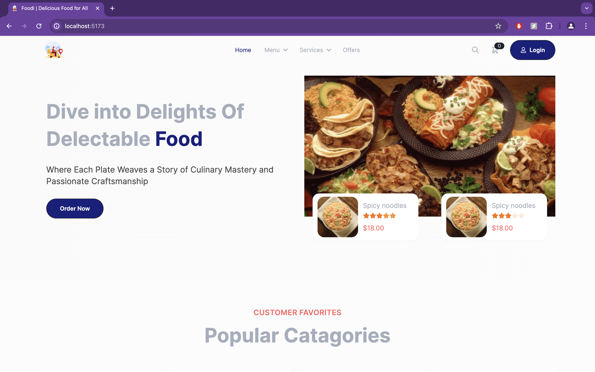
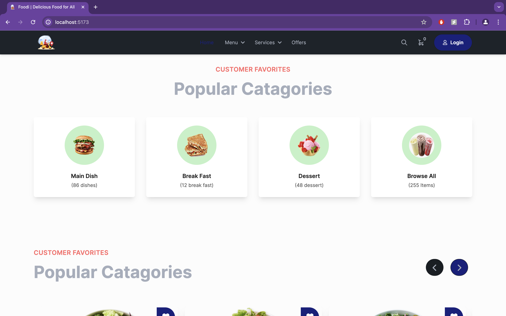
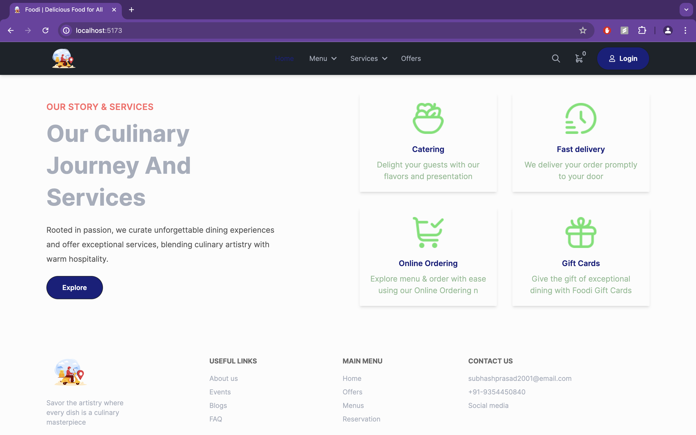
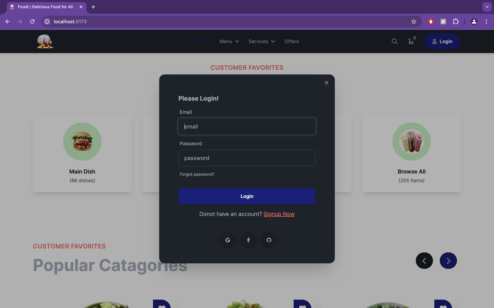
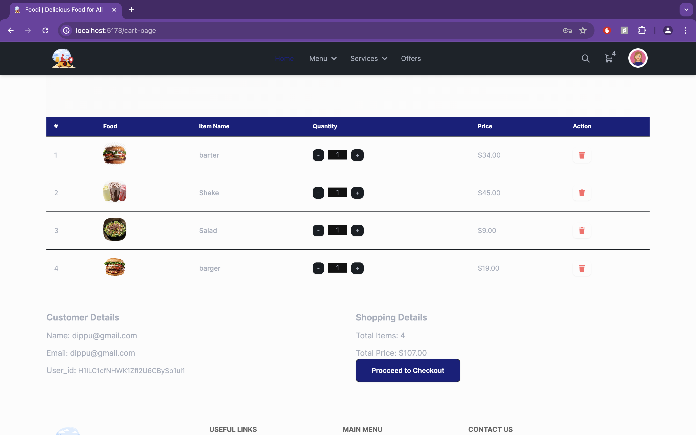

# [FastFeast]([https://travel-saathi.netlify.app/](https://food-app-client-three.vercel.app))

## 📌 Introduction

[](https://awesome.re)

FastFeast is a fully responsive web application designed to facilitate food ordering. The platform prioritizes user-friendliness, leveraging a robust backend powered by Node.js, Express.js, and MongoDB for efficient data storage and management. Security is paramount with JWT authentication safeguarding user information, while integration with Stripe and PayPal ensures secure and reliable payment processing.

## 🚀 View Live Demo


<pre><center><a href="https://food-app-client-three.vercel.app"><b>https://food-app-client-three.vercel.app</b></a></center></pre>

## 👨‍💻 Tech Stack Used

### Frontend
 - ReactJS, TailwindCSS, Material UI, JavaScript, Axios, AuthContext, React-icons
### Backend
 - Node.js, Express.js, JWT, MongoDB, Firebase
### Payment Integration
 - Stripe, PayPal

## 🛠️ Installation Steps

Star and Fork the Repo 🌟 and this will keep us motivated.

1. Clone the repository

```bash
git clone https://github.com/subhashdippu/FastFeast.git
```

2. Change the working directory

```bash
cd FastFeast
```

3. Install dependencies

```bash
npm install
```

4. Run the app

```bash
npm run start
```

## 📸 Screenshots








